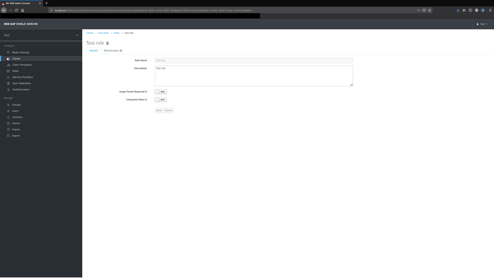
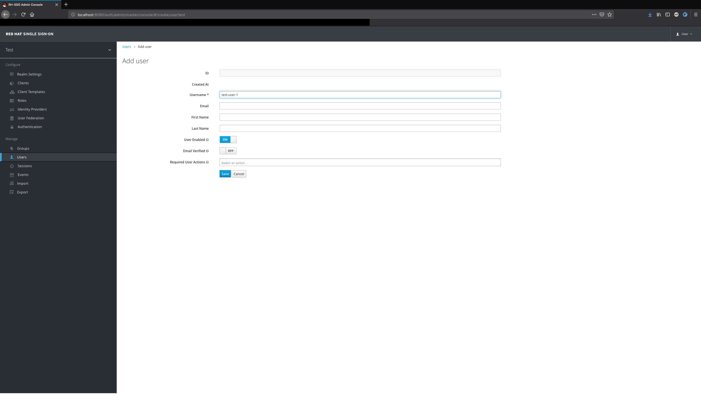
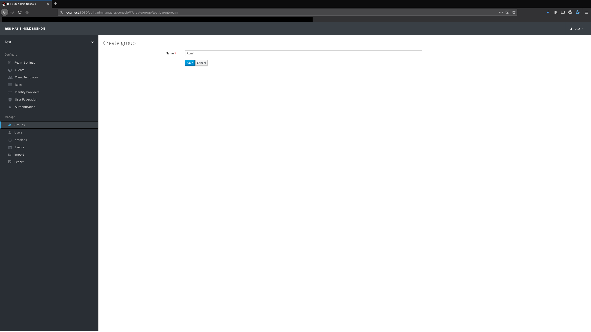
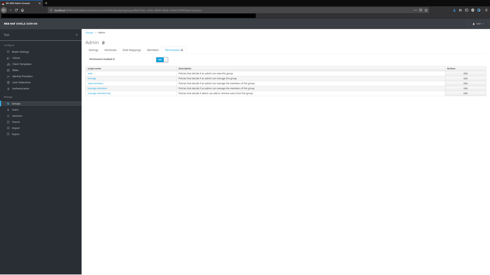
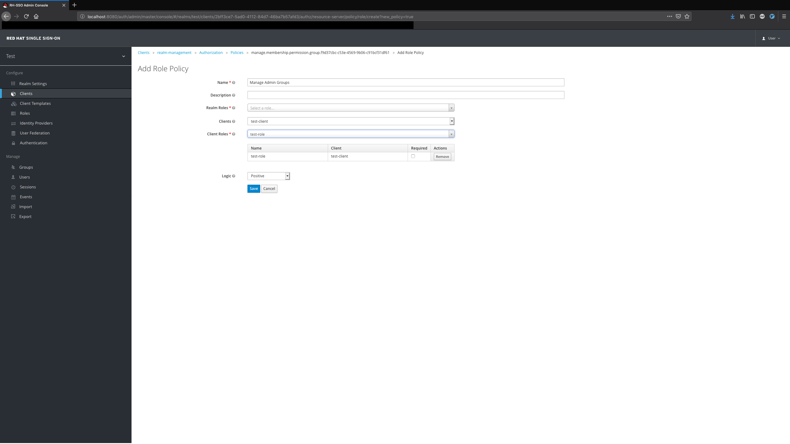
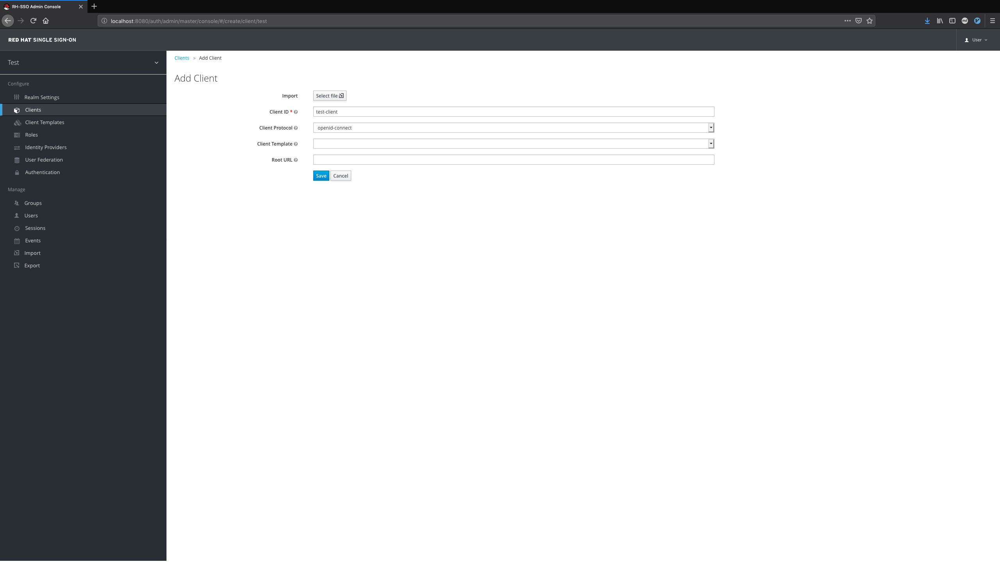

# OAuth Flows with Red Hat SSO/Keycloak

Even if you've never heard of an OAuth flow before, you'll most certainly have used one. Say you've signed in to some third-party application with your Google account, or Facebook account, or GitHub account…you get the gist.

Apps use OAuth flows to allow you to sign in with external accounts. This involves a few steps:

1. Linking the user to the external party, where they'll sign in. This is normally represented by those 'Sign in with Google' or similar buttons. You're taken to a sign-in page for that service, saying something like '[application] would like to use your [service] account'. A few extra parameters are sent, including what scope the application has on your account, and a redirect URI, which is used for…
2. Redirecting them back to the original service, with a code. The original service can then use this code in a behind-the-scenes request - it'll swap it out for a bona-fide access token from the external party. The code has a very short expiry time and can only be used once, which prevents against certain kinds of attacks.
3. The service exchanging the code for a real access token. The access token is normally an encrypted string containing some data on the user and their access level. As long as you've got the RSA key of the original service, you can guarantee that this is legitimate.

With a SSO platform like Keycloak/Red Hat SSO, you can build something just like this into one of your own apps. I'd definitely suggest using this over Devise, as while it isn't quite as well documented, there's the instant bonus of being able to use one platform for sign-in across all your apps. Let's get started.

---

## Setting up your environment

This is the easy part - I've already got a sample docker-compose set up. This gives you your own Red Hat SSO instance to play with, plus a Ruby Alpine environment for fast booting. I'm starting to sound like a car salesman or something...

### Step 1: Rock Around The Clonk

I've built a gem that'll make this tutorial a ton easier. If you'd prefer to interface with the API on your own terms, that's fair enough, but I built Clonk from the understanding I've gained having worked with SSO on a company project. It's fully featured enough for my needs. The response and parsed_response methods are strong enough to deal with just about anything you want to throw at the API. Enough talk - let's see it in action!

First off, install Clonk by adding it to your Gemfile, then running docker-compose build to install it and other dependencies into your container.

```ruby
gem 'clonk'
```

### Step 2: You Seed That?

Right now, there's nothing in your SSO instance. No users, no groups, no clients, nothing. Not even a realm to start with. So, how can we use Clonk to take care of this?

#### Authentication

The first thing that needs to be done is that you'll need to authenticate with SSO via Clonk. Right now, it's done as follows:

```ruby
require 'clonk' # Requires Clonk as a dependency.
def sso(realm_exists = true)
  @sso = Clonk::Connection.new(  # Creates a Connection object, with…
  base_url: 'http://sso:8080', # ...a link to our SSO container…
  realm_id: 'master', # …that authenticates against the master realm…
  username: 'user',   # …with these credentials…
  password: 'password',
  client_id: 'admin-cli' # …against this client.
  )
  unless realm_exists
    @sso.create_realm(realm: 'test_realm')
  end
  @sso.realm = @sso.realms.find { |realm| realm.name ==  'test_realm' }
  @sso
end
```

I'm looking to add OAuth2 autorenewal to the gem, but your session will be refreshed every time you call it.

What we're doing here is authenticating as the admin user, whose credentials are defined in the environment variables SSO_ADMIN_[USERNAME|PASSWORD]. Keep those credentials well under wraps! We're also creating an extra realm if necessary - acting within the master realm might be a bad call for security reasons.


#### Realms

It's important to create and work from your own realm, as the Master realm that comes with a fresh instance of SSO has some unique properties. It's home to the admin user - the user whose credentials are defined when SSO is loaded, a user with unspeakable power that spans across realms... Basically, the admin user can make requests not just within the master realm, but in any realm that gets created beyond that. Which is handy when seeding, of course, because you need that kind of power to not keep stumbling on reauthentication. But you don't want it to get any further than that, so keep those credentials as secret as you can.

The master realm also has some quirks of its own. It contains some clients and other objects that can directly affect other realms. The latter half of the `sso` method makes a realm for you and ensures any actions you take will be inside that realm.

#### Roles

Roles don't have too much around them to discuss, but they're great tools for managing permissions, as we'll soon see. They can be mapped to individual users or entire groups. Generally, they should be created within clients, but I'll explain exactly why that is later.

```ruby
test_client = sso.create_client(clientId: 'test-client')
test_role = sso.create_role(
 client: test_client, 
 name: 'Test Role', 
 description: 'Test role'
)
```



#### Groups and Users

Here's the fun part. Users have credentials that your apps' users can sign in with - one set of credentials for all your apps, in the true spirit of single sign-on. You can store plenty of data inside a User. Their name is given as part of the main form, but there's a whole attributes section that's prime space for your own metadata - whether that's their given name, their quest, their favorite color, you name it.

Here's a snippet you can use to make a few users. It'll return the array of usernames you've passed in as an array of actual users created in SSO, and their passwords will be set there too! Just one user is made in the seed script I've provided.

```ruby
users = []
%i[test1 test2 test3].each do |username|
 user = sso.create_user(username: username)
 users << user
 sso.set_password_for(user: user, password: 'foobar')
end
```



If you want to group up your users, you can try this.

```
app_group = sso.create_group(name: 'App')
users_group = sso.create_subgroup(group: app_group, name: 'Users')
sso.add_to_group(
  user: sso.users.find { |u| u.username == 'test1' }, 
  group: users_group
)
admins_group = sso.create_subgroup(group: app_group, name: 'Admins')
sso.add_to_group(
  user: sso.users.find { |u| u.username == 'test2' },
  group: admins_group
)
```



#### Permissions

Permissions can be pretty interesting too, and there are a couple of ways you can assign them. There's some logic I've enjoyed sticking with. I won't go into huge detail on some options listed below, but they might be worth exploring for your use case.
Permissions available to a group in SSO.Basically, what it comes down to is assigning a policy to a permission. A policy contains a list of objects and, depending on the LOGIC set, acts as either a blacklist (NEGATIVE) or a whitelist (POSITIVE). So far, I've only really seen a use case for the latter, as it's generally more secure to be picky about what you want to be able to access something.



Assigning one of these policies to a permission attributes that permission to the objects in that policy. Essentially it's like saying "I allow/deny these groups/users/etc to [permission] this [object]."

As mentioned before, there's a few ways you can play with this. I recommend the last one, and haven't really tested the others.

- Creating a user policy containing users who can access the object
- Mapping a role to a group, then creating a group policy with that role in the groups claim
- Mapping a role to a group, then creating a role policy



#### Clients

Clients represent apps. If there's one thing to know about them, it's that. When the user authenticates with Red Hat SSO, they give a client ID and authenticate against that client. This is important because each client can, and should, have different degrees of access. Perhaps they'll have roles specific to themselves that mark out particular users or groups as admin users - or if they're apps focused on wrapping and manipulating SSO itself, maybe they'll need access to some of the `realm-management` roles that a user can have?

You should ideally have a client per app and tailor what it can access to needs of the app. In SSO, this is normally done by mapping scope to the client. Scope represents what a client can see from a user. When you authenticate with services like Facebook and GitHub through other apps, you might see something along these lines:

**Application** would like to access your **public profile** and **friends list**.

Let's translate that. In this instance, the application is represented by the client, and what it wishes to access represents the scope that you'd like to give it. In an ideal world, apps wouldn't be too heavy-handed in demanding scope, but there have been plenty of cases where that's not been the case - in particular, apps on mobile devices can be overly demanding of scope, particularly for location services. C'mon, man! You're a notes app! You don't need my phone number!

Scope is particularly important for single sign-on, where a platform might be aware of a user's permissions across many services - but a client can choose to be ignorant of everything except what it really needs to know, and that's how it should be, really.

We created a client before back in the Roles section, but there are a few tweaks you can make during seeding that'll save you having to click around. Let's make a public client that'll have the redirect URIs we need.

test_client = sso.create_client(
 clientId: 'test-client',
 redirectUris: ['http://localhost:11037', 'http://localhost:11037/callback'],
 publicClient: true
)



Public clients are, as the name implies, public-facing. You don't need to use any kind of secret to be able to authenticate with them. There are also confidential clients - you'll require a secret to authenticate with them, so only an app itself should be able to use these clients when talking to SSO. It's even more important to limit the scope of a confidential client, since if that secret gets out and the client can do more than it should, you could have a pretty destructive scenario on your hands.

Public clients are very safe if you're not giving out too much scope, but the concept of token exchange might be interesting if you're actively interfacing with SSO.

#### Seeding

Now that everything's in place and you've got a script to take care of business, it's time to point that at your running SSO instance and seed. If anything goes wrong, it's safe to delete anything that isn't the master branch. Run the script, and if it's quiet, it should've done everything you expected it to!

### Step 3: Authentication Flow

#### Linking off to SSO

There are a couple of different ways you can authenticate with SSO inside your app. You can roll your own form, but generally, it's a lot more maintainable to link to SSO and let that do half the work for you. Clonk has a method that'll build URLs for login and logout for you. We'll show either based on whether or not the user is logged in.

Add these helper methods to your ApplicationHelper:

```ruby
def sign_in_path
 Clonk.login_url(
 base_url: 'http://localhost:8080', 
 realm_id: 'test', 
 redirect_uri: 'http://localhost:11037/callback', 
 client_id: 'test-client', 
)
end

def signed_in?
 session[:access_token]
end
```

And for now, this can go in a navbar or somewhere else that's accessible from all pages:

```erb
<% if signed_in? %>
 <%= link_to 'Sign in', sign_in_path %>
<% else %>
 <%= link_to 'Log out', Clonk.logout_url(
 base_url: 'http://localhost:8080', 
 realm_id: 'test', 
 redirect_uri: 'http://localhost:11037', 
 ) %>
<% end %>
```

In a later section, we might need to make some changes to the logout URL, as right now, it'll end the SSO session entirely, and that might not be something we want.

One thing you might've picked up on is that we've set a redirect URI...to a route that probably doesn't exist yet. What's going on there?

### Callbacks

This is where steps 2 and 3 of the process happen - we've got our link to SSO, and that has a redirect_uri parameter that'll send us back to a route on the app. The last stage is using that route, the callback, to take the access code and swap it out for a real access token. The callback route isn't something Clonk handles as standard right now, so it's up to you to build your own part for this flow. Here's an example of what that can look like.

```ruby
def callback
  # Take the code from the query parameters that get passed back on redirect
  code = request.query_parameters[:code]
  # Send a request to swap out that code for a real access token
  response = connection(raise_error: false, json: false).post '/auth/realms/test/protocol/openid-connect/token', {
    grant_type: 'authorization_code',
    code: code,
    client_id: 'test-client',
    redirect_uri: 'http://localhost:11037/callback'
  }
  # Save that access token to the session
  session[:access_token] = JSON.parse(response.body)['access_token']
  # redirect back to the root, and return
  redirect_to root_path
end
def connection(raise_error: true, json: true, token: @access_token)
  Faraday.new(url: 'http://sso:8080') do |faraday|
    faraday.request(json ? :json : :url_encoded)
    faraday.use Faraday::Response::RaiseError if raise_error
    faraday.adapter Faraday.default_adapter
    faraday.headers['Authorization'] = "Bearer #{token}" unless token.nil?
  end
end
```

You might also want to display a flash message stating to the user that they've successfully logged in. Or perhaps you'd like to redirect them to a different path. You could even secure your app further by configuring token exchange with a confidential client. There are plenty of ways you can extend your app, and chances are they'll start right about here.

Don't forget your route!

```
get '/callback', to: 'authorization#callback
```

Now your `signed_in?` method in the helper should work, as when a user signs in, they'll get their token and have it saved to that variable in the session - it'll no longer be nil.

### Logging out

We already arranged logging out with the `logout_url` method a little while back. However, that's got one fairly major caveat - the user's token will still remain in the session. The solution there is to make your own wrapper route that not only removes the access token from the session, but redirects to SSO to end the session there too.

```ruby
def sign_out
  session[:access_token] = nil
  redirect_to Clonk.logout_url(
    base_url: 'http://localhost:8080',
    realm_id: 'test',
    redirect_uri: 'http://localhost:11037'
  )
end
```

And the route:

```ruby
get '/sign_out', to: 'authorization#sign_out'
```
You might not necessarily want to end the SSO session, in which case, it's easy enough to send that redirect somewhere different.
Providing everything's seeded correctly, that should all tie together.
A fully seeded realm...hopefully with an app on the side!

---

## Conclusion

The process of setting up SSO with a Rails app is a little more involved than Devise, and certainly takes a fair bit more understanding. But there are plenty of benefits - you get a GUI for user management that you can host securely away from your users, and it's got the support of the Red Hat and JBoss developer communities. It's well worth taking the dive into SSO.

Have a look at this repo if you'd like to understand the basic concepts of how things are hooked up.
